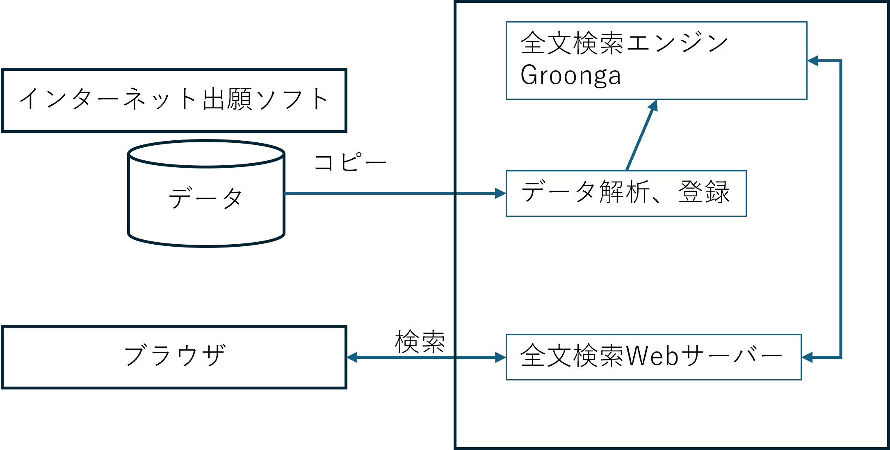
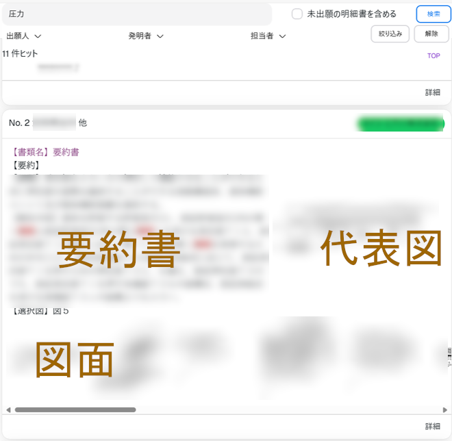
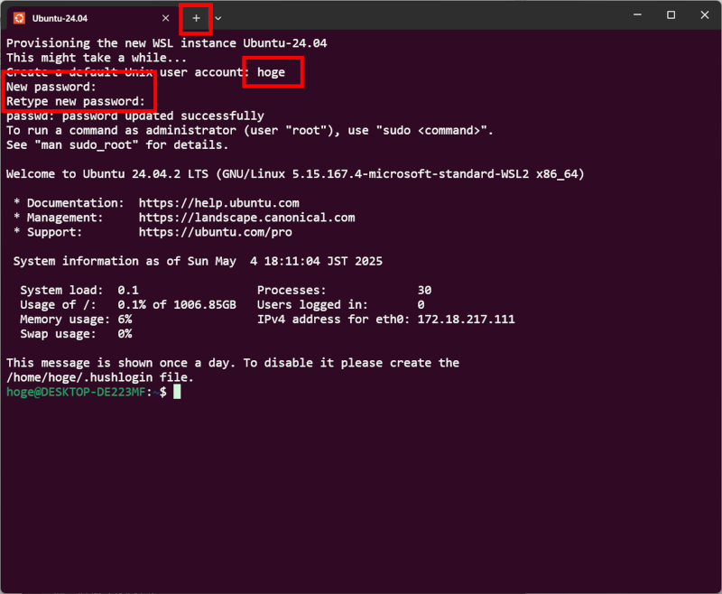
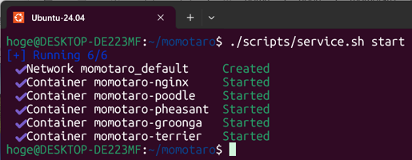
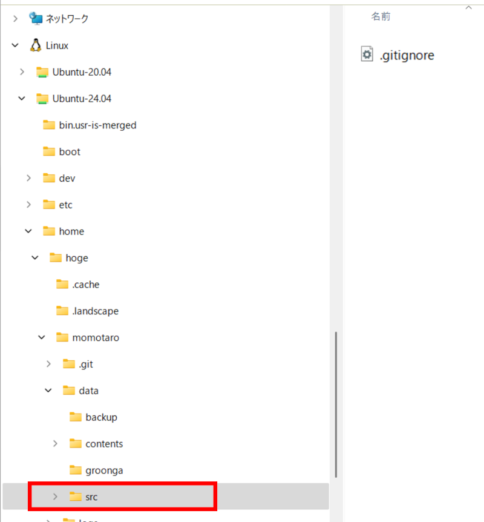

# 特許文書の全文検索サーバー
特許出願、意見書等の特許文書の全文検索サーバーです。
[インターネット出願ソフト](https://www.pcinfo.jpo.go.jp/site/)を使って提出/受信した JWX などの拡張子を持つファイルが検索対象です。
全文検索のエンジンには [Groonga](https://groonga.org/ja/) を使用しています。

## 誰向け？ 
 - インターネット出願ソフトを使って特許出願している人
 - まだjplatpatに公開されていない明細書等を検索したい人
 - 図面をぱっとみで探したい人
 - 明細書等にメモを残したい人

## サーバーの概略構成



## 検索画面の雰囲気
実際の明細書を出せないのでぼかし.
キーワード「圧力」で検索した結果、要約書と図面のサムネールが表示される。




## 機能
 - 特許出願の明細書等を全文検索できる。請求項、明細書など項目別検索も可
 - 意見書、補正書、拒絶理由通知書、拒絶査定など中間文書を全文検索できる
 - 図面一覧の検索結果は、ぱっと見で図面を探しやすい（とおもう）
 - 担当者、整理番号、メモ、タグを各文書に付与できる


## 動作環境
 - Windows 11
 - WSL2.0 Ubuntu
 - python3
 - git
 - docker v28

Ubuntu(Linux) の基本的な知識が必要

## インストール
### WSL2.0
Windows Sussystem for Linux(WSL) Windows で Linux 実行環境を実現するサブシステム。
「WSL インストール」で検索して、Windows に WSLをインストールし、Ubuntu ディストリビューションをインストールしてください。

### Docker
「ターミナル」を起動し、インストールした Ubuntu を起動してください。
初回起動時は、新規ユーザー名、パスワードが求められます。


#### Set up Docker's apt repository
Docker をインストールします。
↓[Docker 公式サイト](https://docs.docker.com/engine/install/ubuntu/) より引用。

```bash
# Add Docker's official GPG key:
sudo apt-get update
sudo apt-get install ca-certificates curl
sudo install -m 0755 -d /etc/apt/keyrings
sudo curl -fsSL https://download.docker.com/linux/ubuntu/gpg -o /etc/apt/keyrings/docker.asc
sudo chmod a+r /etc/apt/keyrings/docker.asc

# Add the repository to Apt sources:
echo \
  "deb [arch=$(dpkg --print-architecture) signed-by=/etc/apt/keyrings/docker.asc] https://download.docker.com/linux/ubuntu \
  $(. /etc/os-release && echo "${UBUNTU_CODENAME:-$VERSION_CODENAME}") stable" | \
  sudo tee /etc/apt/sources.list.d/docker.list > /dev/null
sudo apt-get update
```

```bash
# Install the Docker packages.
sudo apt-get install -y docker-ce docker-ce-cli containerd.io docker-buildx-plugin docker-compose-plugin
```

#### docker 初期設定
sudo なしで docker 起動するための設定
```bash
sudo usermod -aG docker hoge
```

docker service 起動
```bash
sudo service docker start
```

ターミナルを終了し、再度ターミナルを起動しなおしてください。


### 全文検索サーバーのインストール
適当なディレクトリ、ここでは /home/hoge とする。

```bash
cd /home/hoge
git clone https://github.com/hyperion13th144m/momotaro
cd momotaro
cp .env.sample .env
docker compose pull
```

/home/hoge/momotaro に次のようなファイル、ディレクトリが作成される。
```bash
/home/hoge/momotaro
├── data
│   ├── backup
│   ├── contents
│   ├── groonga
│   └── src                # ここにインターネット出願ソフトのデータをアップロードする
├── docker-compose.yaml
├── LICENSE
├── scripts
│   ├── crawler.sh
│   ├── launch-crawler.py
│   └── service.sh
└── logs
    ├── gibbon
    ├── groonga
    ├── nginx
    ├── pheasant
    ├── poodle
    └── terrier
```

## 使い方
### サーバー起動
```bash
cd /home/hoge/momotaro
./scripts/service start
```



### データの準備
  インターネット出願ソフトの「データ出力」で処理したいアーカイブと手続XMLファイルを吐き出し、 WSL のフォルダにコピーする。WSLのフォルダーは、 [Linux] -> [Ubuntu-24.04] -> [home] -> [hoge] -> [momotaro] -> [data] -> [src] 、ここにエクスプローラーでコピーする。[Ubuntu-24.04] は WSLをインストールする際に指定したUbuntuディストリビューション。[hoge]は作成したユーザー名。


 
  インターネット出願ソフトのデータ格納フォルダ(C:\JPODATA など)から処理したいアーカイブと、手続XMLファイルをコピーしてもよい。インターネット出願ソフトの「出願」->「利用者1」->「受理済」にある「特許願」を対象にするなら、C:\JPODATA\ITAK.JP0\APPL.JP1\利用者1.J01\ACCEPT.J04 にアーカイブと手続ファイルがある。


  - 202501010000123456_A163_____XXXXXXXXXX__99999999999_____AFM.XML
  - 202501010000123456_A163_____XXXXXXXXXX__99999999999_____AAA.JWX

このような二つの対のファイルが必要。
面倒なら、C:\JPODATA\ITAK.JP0\APPL.JP1　C:\JPODATA\ITAK.JP0\NOTICE.JP1　をまるまるコピーでよい。

### データ登録
```bash
cd /home/hoge/momotaro
python3 ./scripts/launch-crawler.py > logs/gibbon/crawl.log
```
出願6000件、中間文書13000件で、登録に約2時間かかった（動作環境による）。

### 検索など
PCのブラウザから [http://localhost](http://localhost/) にアクセする。
 - 簡易検索: スペース区切りで AND 検索。特許出願の文書全体が検索対象。
 - 詳細検索: 特許請求の範囲など項目別に検索可能。スペース区切りで OR 検索。特許出願の文書全体が検索対象。
 - 中間文書検索: 意見書、拒絶理由通知書などが検索対象
 - 管理メニュー
   * 付記事項のバックアップ: 各文書に付与した担当者、メモ、タグ、整理番号をエクセルファイルに保存できる。
   * 付記事項のバックアップ一覧: ↑のエクセルファイルのダウンロード
   * 付記事項のリストア: ↑のエクセルファイルをデータベースに戻す

#### 付記事項について
**要加筆
バックアップしたエクセルファイルに担当者など入力し、そのエクセルファイルをリストアする。
担当者などまとめて登録できる。


## 注意事項

 - インターネット出願ソフトが動作しているパソコンと、WSL、本検索サーバのパソコンは別でOK
 - インターネット出願ソフトのデータを WSL の src フォルダに移動ではなくコピーしてお使いください。
 - WSL のPCのブラウザのみ検索サーバーにアクセスできます。別PCから検索サーバーにアクセスできません。
 - テストは十分でない、素人が見よう見まねで作ってるのでいろいろバグあるとおもう。
 - インターネット出願ソフトと同様に表示されるよう HTML を生成しているが、まったく同じでないです。生成されたHTMLはあくまで参考用に。
 - 本サーバーでの処理は WSL のみで完結しており、外部のクラウド等にデータを送信していません。
 - 予告なく公開停止することがあります。
 - 本アプリで何らかの損害を被っても本アプリ作者は責任を負いません。


## Contact
 動作しないなどあったら [GitHub Issues](https://github.com/hyperion13th144m/momotaro/issues) までどうぞ。(Github Issues 使ったことがないけど）

## License
MIT license です。無償です。いかなる保証もありません。
